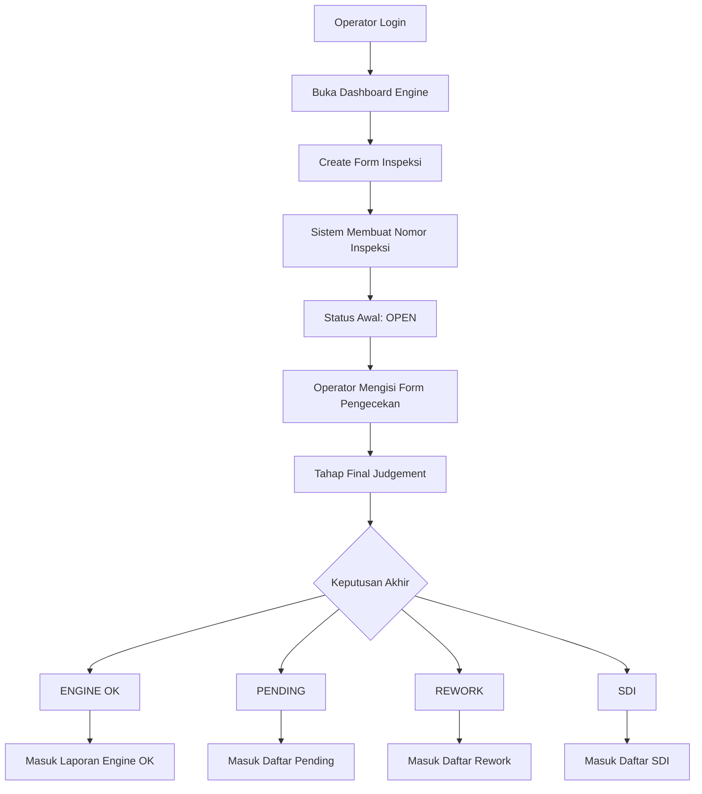
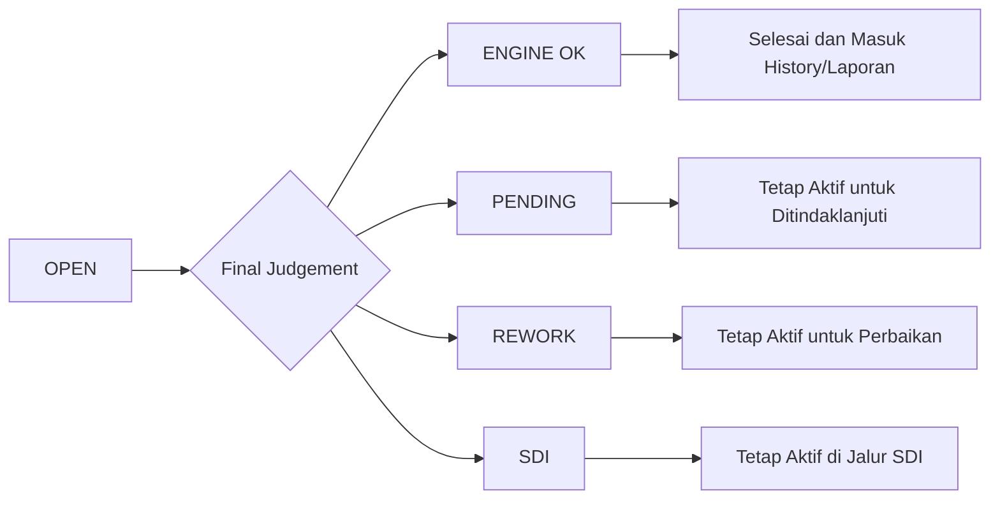
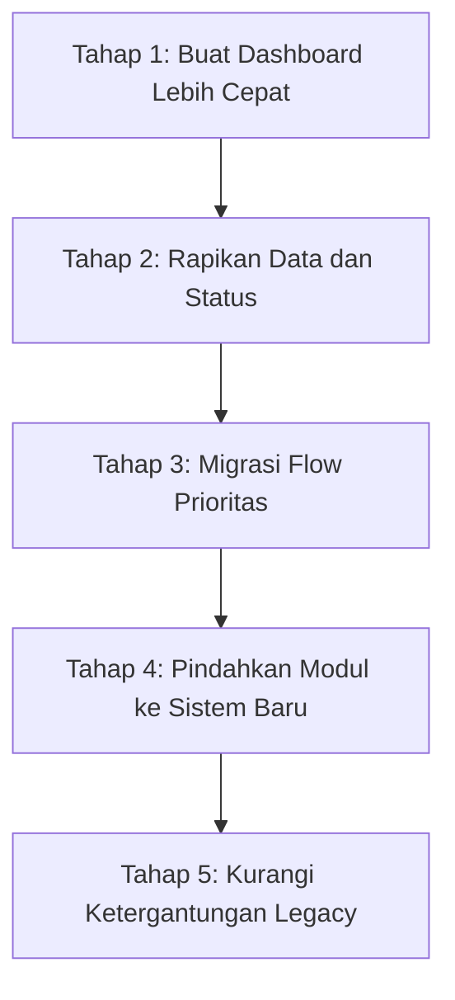

# Report Management: Alur Status Inspeksi Engine IQ-Pro

Tanggal draft: 13 Agustus 2026

## 1. Inti Penjelasan

Aplikasi IQ-Pro dipakai untuk mencatat proses inspeksi engine dari awal sampai hasil akhir. Setiap engine yang diperiksa akan memiliki satu nomor inspeksi. Nomor ini menjadi identitas utama untuk melihat posisi proses engine tersebut.

Secara sederhana, alurnya adalah:

1. Operator membuat form inspeksi.
2. Sistem memberi status awal `OPEN`.
3. Operator mengisi hasil pengecekan.
4. Di akhir proses, operator memilih keputusan akhir.
5. Sistem memindahkan engine ke kategori hasil sesuai keputusan tersebut.

Status yang umum dipakai:

| Status | Arti untuk user |
| --- | --- |
| `OPEN` | Form inspeksi baru dibuat dan proses pengecekan masih berjalan. |
| `ENGINE OK` | Engine selesai diperiksa dan hasilnya OK. |
| `PENDING` | Pengecekan belum bisa diselesaikan dan perlu menunggu. |
| `REWORK` | Engine perlu perbaikan atau pengerjaan ulang. |
| `SDI` | Engine masuk jalur khusus SDI dan perlu tindak lanjut sesuai proses internal. |

## 2. Flow Utama Inspeksi Engine

## 3. Penjelasan Tiap Tahap

### 3.1 Create Form

Pada tahap ini operator memilih data engine yang akan diperiksa, seperti:

- tipe form inspeksi,
- nomor engine,
- model engine,
- nomor ECU,
- nomor supply pump,
- area atau test bench.

Setelah form dibuat, sistem memberi nomor inspeksi dan status awal `OPEN`.

Maknanya untuk operasional:

- Engine sudah masuk proses pengecekan.
- Data muncul di daftar status `OPEN`.
- Operator dapat melanjutkan pengisian hasil inspeksi.

### 3.2 Proses Pengecekan

Operator mengisi hasil pengecekan sesuai item yang sudah disiapkan di form. Item ini dapat mencakup pemeriksaan running, performance, dan bagian visual/area engine.

Maknanya untuk operasional:

- Engine masih dalam proses.
- Belum ada keputusan akhir.
- Status masih dianggap aktif.

### 3.3 Final Judgement

Setelah pengecekan selesai, operator memilih hasil akhir:

- `ENGINE OK`
- `PENDING`
- `REWORK`
- `SDI`

Keputusan ini menentukan engine akan masuk ke daftar mana.

## 4. Arti Status dalam Bahasa Operasional

### 4.1 `OPEN`

`OPEN` berarti inspeksi sudah dibuat tetapi belum selesai.

Contoh kondisi:

- Engine baru mulai diperiksa.
- Form sudah ada, tetapi item inspeksi belum lengkap.
- Operator masih perlu melanjutkan input.

Tampilan di aplikasi:

- Dashboard status open.
- Monitoring engine open.

### 4.2 `ENGINE OK`

`ENGINE OK` berarti engine sudah selesai diperiksa dan hasilnya baik.

Contoh kondisi:

- Semua proses pengecekan selesai.
- Tidak ada catatan pending/rework.
- Engine dapat dianggap selesai dari sisi inspeksi.

Tampilan di aplikasi:

- Dashboard Engine OK.
- Monitoring Engine OK.
- Report/laporan history.

Catatan penting untuk management:

Data `ENGINE OK` dianggap selesai, sehingga masuk ke bagian laporan/history, bukan lagi daftar pekerjaan aktif.

### 4.3 `PENDING`

`PENDING` berarti proses belum bisa diputuskan selesai.

Contoh kondisi:

- Ada data yang belum lengkap.
- Ada proses yang menunggu konfirmasi.
- Ada pemeriksaan yang belum bisa diselesaikan hari itu.

Tampilan di aplikasi:

- Dashboard Pending.
- Monitoring Pending.

Catatan:

Sistem juga memiliki proses yang dapat mengubah data lama dari `OPEN` menjadi `PENDING` jika melewati hari berjalan.

### 4.4 `REWORK`

`REWORK` berarti engine perlu diperbaiki atau dikerjakan ulang sebelum bisa dinyatakan selesai.

Contoh kondisi:

- Ada hasil pengecekan yang tidak sesuai.
- Ada temuan yang harus diperbaiki.
- Engine belum bisa dinyatakan OK.

Tampilan di aplikasi:

- Dashboard Rework.
- Monitoring Rework.

### 4.5 `SDI`

`SDI` adalah jalur khusus setelah inspeksi. Dari sisi aplikasi, SDI diperlakukan sebagai status tersendiri dan memiliki daftar/form sendiri.

Contoh kondisi:

- Engine tidak langsung masuk OK.
- Engine perlu tindak lanjut sesuai proses SDI.
- Data perlu dipantau melalui daftar SDI.

Tampilan di aplikasi:

- Dashboard SDI.
- Monitoring SDI.

Catatan untuk validasi bisnis:

Kepanjangan dan aturan detail SDI sebaiknya dikonfirmasi ke PIC proses, karena kode aplikasi hanya menunjukkan bahwa SDI adalah salah satu hasil akhir yang sah.

## 5. Flow Status Aktif dan Selesai

## 6. Kenapa Dashboard Bisa Berat

Dashboard menampilkan jumlah engine berdasarkan status. Artinya aplikasi perlu menghitung data seperti:

- berapa engine yang masih `OPEN`,
- berapa yang `PENDING`,
- berapa yang `REWORK`,
- berapa yang `SDI`,
- berapa yang sudah `ENGINE OK`.

Jika data sudah sangat besar, dashboard akan terasa lambat karena sistem harus membaca banyak data untuk menghitung angka tersebut.

Bahasa sederhananya:

> Dashboard bukan hanya menampilkan tampilan, tetapi juga menghitung ulang banyak data setiap kali dibuka.

Dampaknya:

- halaman dashboard lama terbuka,
- user menunggu sebelum bisa bekerja,
- server/database ikut terbebani,
- semakin besar data, semakin terasa lambat.

## 7. Rekomendasi Pembenahan Bertahap

Rekomendasi yang paling aman adalah pembenahan bertahap, bukan mengganti seluruh aplikasi sekaligus.

Tahapan yang disarankan:

### Tahap 1 - Dashboard lebih cepat

Dashboard tetap muncul dulu, lalu angka-angka berat dihitung di background.

Manfaat:

- user tidak menunggu terlalu lama,
- menu lain tetap bisa dibuka,
- aplikasi terasa lebih responsif.

### Tahap 2 - Rapikan data dan status

Status seperti `OPEN`, `ENGINE OK`, `PENDING`, `REWORK`, dan `SDI` perlu dibuat lebih jelas secara aturan bisnis.

Manfaat:

- laporan lebih mudah dipahami,
- risiko salah baca status berkurang,
- migrasi ke sistem baru lebih aman.

### Tahap 3 - Migrasi flow prioritas

Mulai dari flow yang paling sering dipakai dan paling jelas alurnya.

Contoh kandidat:

- dashboard engine,
- dashboard transmisi,
- flow PDI/TM,
- monitoring status.

Manfaat:

- hasil pembaharuan cepat terlihat,
- risiko lebih kecil,
- user bisa mencoba bertahap.

### Tahap 4 - Pindahkan modul ke sistem baru

Setelah flow prioritas stabil, modul dapat dipindahkan ke platform baru secara bertahap.

Manfaat:

- aplikasi lebih mudah dirawat,
- pengembangan fitur baru lebih cepat,
- risiko error dari kode lama menurun.

### Tahap 5 - Kurangi ketergantungan legacy

Jika modul baru sudah stabil, halaman lama bisa dialihkan atau dihentikan.

Manfaat:

- biaya maintenance turun,
- sistem lebih siap untuk jangka panjang,
- upgrade teknologi lebih mudah dilakukan.

## 8. Manfaat untuk Management

Manfaat dari pembaharuan bertahap:

- Operasional tetap berjalan selama pembenahan.
- Risiko downtime lebih rendah.
- Perubahan bisa dipantau per fase.
- Masalah paling terasa dapat diselesaikan lebih dulu.
- Tim punya dokumentasi alur yang jelas.
- Keputusan investasi lebih mudah karena progress dapat diukur.

## 9. Kesimpulan

Secara proses, aplikasi IQ-Pro engine berjalan dari `OPEN` menuju salah satu hasil akhir: `ENGINE OK`, `PENDING`, `REWORK`, atau `SDI`.

Masalah utama saat ini bukan hanya tampilan dashboard, tetapi cara aplikasi menghitung dan membaca data besar setiap kali dashboard dibuka. Karena itu, pembenahan paling realistis adalah membuat dashboard lebih ringan dulu, lalu merapikan flow dan status, kemudian melakukan migrasi sistem secara bertahap.

Dengan pendekatan ini, management bisa mendapatkan dua hal sekaligus:

- perbaikan cepat yang langsung terasa oleh user,
- arah modernisasi aplikasi yang lebih aman dan terukur.
